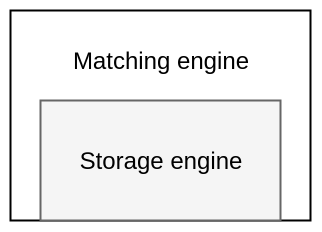

# Technical overview

The exchange consists of two layers

1. Matching engine

2. Storage engine

## 1. Matching engine

The matching engine matches orders. It matches bids with asks on a price-time priority with a first-in first-out (FIFO) algorithm. If two resting orders are present at the same tick, the order which was placed first gets matched first. It also handles different types of orders

- Limit orders
- Post-only orders
- Taker orders
- Fill or kill

The matching engine is implemented in the smart contract with no off-chain components. Orders are matched atomically without the need of cranking.

## 2. Storage engine

The storage engines handles storage and retrieval of orderbook data. In centralized exchanges this engine is a tree data structure that allows fast key-value lookups and iterations.

- Key-value lookups: For random access to orders at a given price tick.

- Iteration: Orders are matched one-after the other in a price-time priority, necessitating iteration.

Goblin has invented a novel storage engine called **Iterable Tick Map** that wraps around EVM's storage-trie for gas efficiency. Ethereum's slot storage is a merkle-patricia tree that allows key-value lookups, but no iterations. The key and value are both 256 bit in size.

### Optimizing storage

The gas cost of EVM storage is as follows

1. Storing data (SSTORE): 20,000 gas on an empty slot.
2. Reading data (SLOAD): 2400 gas

A naive solution is to construct a red-black tree in memory to match orders. For persistent storage we encode it into bytes and storing it in slots. This is wasteful.

1. SSTORE keys are 256 bit in length. If we build a custom tree from slot values, the space in slot keys is underutilized.

2. The entire tree must be read with SLOADs. Write pattern for SSTOREs is unpredictable. This costs a lot of gas.

Optimizations allow Goblin to better utilize the native key-value tree and large 256 bit numbers.

1. Internally Goblin uses 64 bit instead of 256 bit numbers. This allows more data to be stored in the same slot.

2. The SSTORE tree is directly used for random access.

3. The 256 bit key is better utilized. For instance the key for a resting order stores the market index, price tick and the resting order index.

### Enabling iterations

The Iterable Tick Map consists of 3 data structures to iterate across price ticks at a low cost.

#### 1. Resting order

Stores data for a resting order in a slot. The key consists of `(market_index, tick, resting_order_index)`. The slot value consists of the trader address, order size and order expiry time.

#### 2. `OrdersAtTick`

A tick can have upto 8 resting orders. Each tick gets an 8 bit `OrdersAtTick` structure to track active orders. This allows us to

- Find which ticks are active.
- Iterate over active ticks.
- Saves us from reading slots for every tick. SLOADs on empty order slots are avoided.

#### 3. Bitmap

A bitmap is a group of 32 `OrdersAtTick` structs, stored in a 256 bit slot. This way a single slot can store data for 32 ticks and 256 resting orders.

#### 4. Bitmap List

This is a FIFO list to track active bitmap indices. There is one list for bids and another for asks. Indices are stored in ascending order for bids and in descending order for asks. Since ticks in middle of the orderbook are accessed most, having them at the end allows cheaper updates. Updates at beginning of the list, i.e. furthest from middle of the orderbook cost more because the entire list must be shifted right.

When matching a bid order the system

1. Reads the last element of the bitmap list
2. Reads the corresponding bitmap to know active orders at that tick
3. Reads the resting order

Together these data structures enable gas efficient iteration and random lookups.